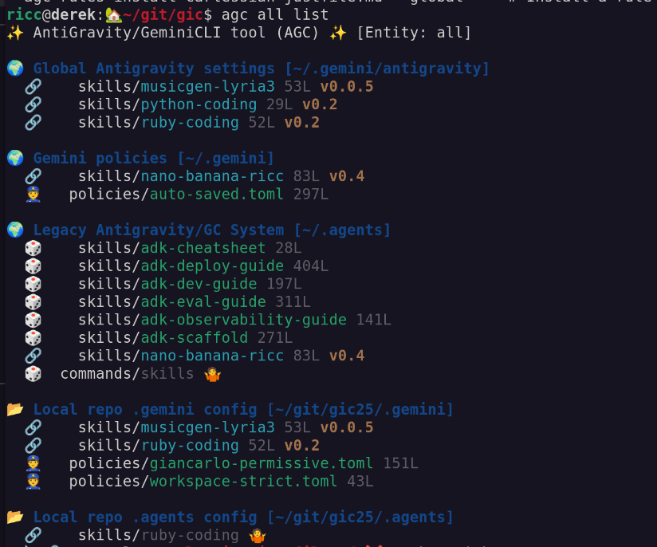

# agc: AntiGravity/GeminiCLI tool

`agc` is a unified CLI tool designed to **list and manage AntiGravity (`agy`) and Gemini CLI (`gc`) entities**, including skills (first and foremost), policies, custom commands, rules, and workflows. 

Essentially, it's a CLI tool that discovers all relevant assets across your known directories and makes it easy to install or symlink them from your base repositories into your global or local workspaces.

## Key Features

- **Rich CLI Output:** Visualizes entities with clear color-coding (e.g., distinguishing **symlinks**), and displays **skill size**, **version**, and **languages used**.
- **Entity Discovery:** Easily list and search for all `agy` and `gc` entities (skills, policies, commands, rules, workflows) across known directories.
- **Smart Installation:** Automates symlink management, easily linking items from your base folders to local (`./.gemini/`) or global (`~/.gemini/`) workspaces.
- **Extensible:** Configurable via YAML to support custom folder structures.

Example of `agc skills list` (also shows GC Policies!):



## Installation

To install `agc` and make it available in your shell:

1. **Clone the repository:**
   ```bash
   git clone https://github.com/palladius/agc.git
   cd agc
   ```

2. **Add to your PATH:**
   Add the following line to your `~/.bashrc`, `~/.zshrc`, or equivalent:
   ```bash
   export PATH="$PATH:$(pwd)/bin"
   ```
   *Note: Ensure you provide the absolute path to the `bin` directory.*

3. **Verify Installation:**
   ```bash
   agc --help
   ```

### Prerequisites
- **Ruby:** `agc` is written in Ruby and requires a modern Ruby environment.

## Configuration

`agc` uses a YAML configuration file to discover your specific base directories. You can easily get started by copying the provided sample configuration:

```bash
cp etc/riccardo_sample.yaml ~/.agc.yaml
```

Once copied, open `~/.agc.yaml` in your favorite editor and modify the `folders` list to point to your actual Git repositories and entity directories. `agc` also supports project-level config (`./.agc.yaml`) and XDG standard paths (`~/.config/agc/config.yaml`).

## Quick Start

List all available skills:
```bash
agc skills list
agc skills banana # Searches for skills with 'banana' in the name
agc skills install nano-banana-ricc --global # Installs a skill globally once I found the exact name.
```

Install a skill globally:
```bash
agc skills install <skill-name> --global
```

For more detailed usage, please refer to the [User Manual](USER_MANUAL.md).

## Documentation

- **Antigravity Rules and Workflows:** [Official Docs](https://antigravity.google/docs/rules-workflows)
- **AGC User Manual:** [USER_MANUAL.md](USER_MANUAL.md)
- **Changelog:** [CHANGELOG.md](CHANGELOG.md)

---
## Project Identity

<p align="center">
  
</p>

**Name:** AG⚡GC (contracted to `AGC`)
**Codename:** 双子座のカノン (*Gemini no Kanon*)
