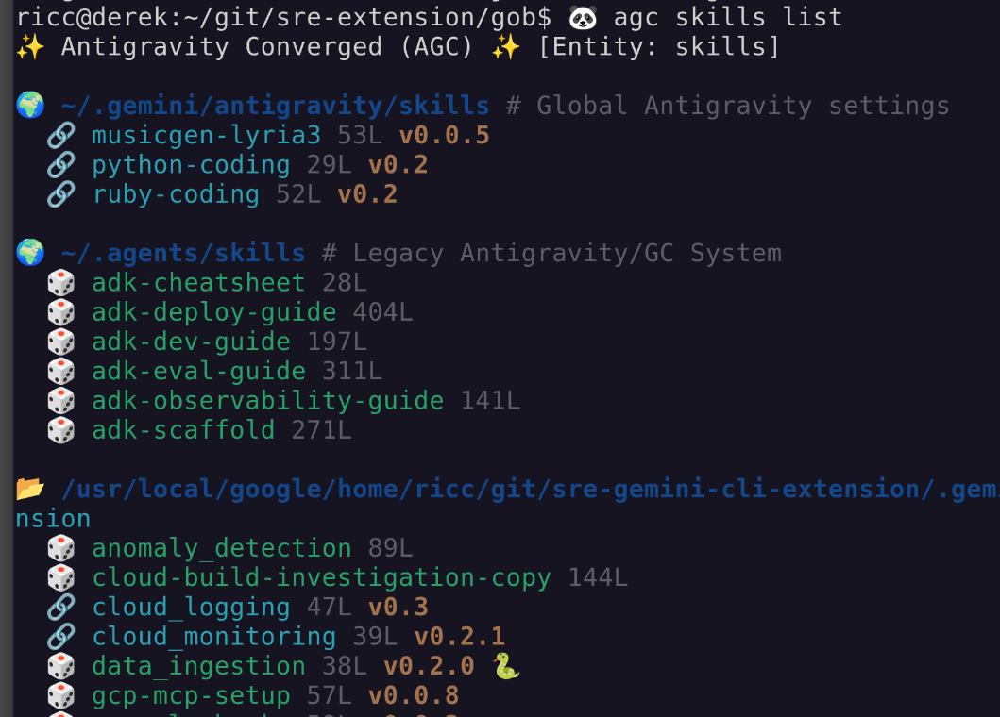

# agc: AntiGravity/GeminiCLI tool

`agc` is a unified CLI tool designed to converge **Antigravity** and **Gemini CLI** workflows. It provides a single interface to discover, install, and manage skills, rules, workflows, custom commands, and policies across both ecosystems.

**Codename:** 双子座のカノン?, Jemini no Kanon

## Key Features

- **Rich CLI Output:** Visualizes entities with clear color-coding (e.g., distinguishing **symlinks**), and displays **skill size**, **version**, and **languages used**.
- **Unified Management:** Manage entities for both Antigravity and Gemini CLI.
- **Entity Discovery:** Easily list and search for skills, rules, and workflows.
- **Smart Installation:** Automates symlink management for local and global installations.
- **Extensible:** Configurable via YAML to support custom folder structures.



## Installation

To install `agc` and make it available in your shell:

1. **Clone the repository:**
   ```bash
   git clone https://github.com/palladius/agc.git
   cd agc
   ```

2. **Add to your PATH:**
   Add the following line to your `~/.bashrc`, `~/.zshrc`, or equivalent:
   ```bash
   export PATH="$PATH:$(pwd)/bin"
   ```
   *Note: Ensure you provide the absolute path to the `bin` directory.*

3. **Verify Installation:**
   ```bash
   agc --help
   ```

### Prerequisites
- **Ruby:** `agc` is written in Ruby and requires a modern Ruby environment.

## Quick Start

List all available skills:
```bash
agc skills list
agc skills banana # Searches for skills with 'banana' in the name
agc skills install nano-banana-ricc 
```

Install a skill globally:
```bash
agc skills install <skill-name> --global
```

For more detailed usage, please refer to the [User Manual](USER_MANUAL.md).

## Documentation

- **Antigravity Rules and Workflows:** [Official Docs](https://antigravity.google/docs/rules-workflows)
- **AGC User Manual:** [USER_MANUAL.md](USER_MANUAL.md)
- **Changelog:** [CHANGELOG.md](CHANGELOG.md)
